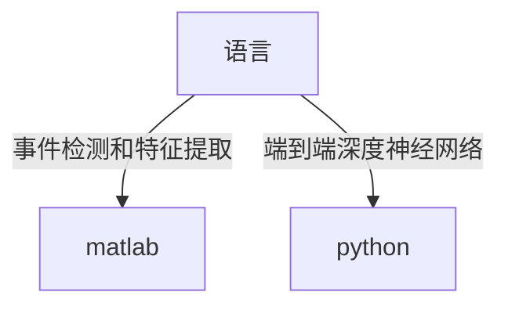

# NILM-中文教程
完成我的毕业论文，顺便记录一下NILM(非侵入式负荷监测)的学习过程，帮助其他研究NILM的中国学生轻松上手

这三十天我会陆续更新，直到完成我的毕业论文

如果你同样对NILM感兴趣，欢迎加我QQ 1400237799，互相学习互相进步。但是，加我的人太多了，我已经毕业工作了，所以可能没有太多时间回复。所以欢迎大家有问题直接提issue，这样无论谁看到了都可以回答。
**(如果是院所或企业，欢迎商业合作！已有多个国内外合作经验:smile:)**

最欢迎的是，大家可以把自己的学习笔记提交PR到这个仓库，让后来的人更容易参与到NILM这个领域。

**如果你觉得这个仓库对你有一点点帮助，请给个小星星:star:**
## 投稿推荐
Sensors（SCI三区）特刊“具有有意义的性能评估的实用非侵入式负载监控方法” **稿件提交截止日期：2023 年 6 月 30 日**
https://www.mdpi.com/journal/sensors/special_issues/practical_nonintrusive_load_monitoring_approaches_with_meaningful_performance_evaluation
## 一些汇总仓库（英文）：
### awesome NILM 
一个包含优秀的NILM文章的仓库，但只有文章链接https://github.com/ch-shin/awesome-nilm 个人认为不公开源代码的不算优秀，是骡子是马拉出来遛遛 **贵在还在更新**
### awesome NILM with code
一个包含优秀的公开代码的NILM文章的仓库https://github.com/zhgqcn/awesome-NILM-with-code **可惜已经停更了**
### ~~nilm-papers-with-code~~
https://github.com/klemenjak/nilm-papers-with-code 功能同上，**2021年后就不更新了，内容也少**，还是看上面那个仓库

## 选择编程语言

关于做NILM方向选择编程语言主要有两个，一个是用matlab，一个是用python。如果你主要想在事件检测和特征提取方面做文章，也就是搞机器学习，最好选择matlab，因为这部分可以借鉴的代码多。如果你想做端到端的方法，一般在神经网络方面做文章，也就是搞深度学习，最好选择python，因为这部分开源的代码都是用python写的。

## NILM工具或框架
### [NILMTK](https://github.com/nilmtk/nilmtk) 著名的NILM工具包

著名的NILM工具包，最棒的是用它可以很方便的读取现有的各种NILM数据集

#### [NILMTK-Contrib](https://github.com/nilmtk/nilmtk-contrib)
基于NILMTK，提供了一些经常使用的算法。
这里Contrib的意思是这些算法是NILMTK团队之外的学者提出的

** NILMTK和NILMTK-Contrib的国内最简单安装教程见：https://github.com/shaoshuai6666/NILM-Chinese/blob/main/Installation_Tutorial.md

## 相关研究机构
1. [非侵入式负载监测国际研讨会(International Workshop on Non-Intrusive Load Monitoring)](http://nilmworkshop.org/)
2. [欧盟NILM研讨会(EU NILM Workshop)](https://www.oliverparson.co.uk/eu-nilm-workshop)
2. [弗劳恩霍夫微电子电路与系统研究所(Fraunhofer IMS)](https://www.ims.fraunhofer.de/en/Business_Units_and_Core_Competencies/Electronic-Assistance-Systems/Applications/NILM.html)
## 我个人认为不错的工作，适合新手学习
### nilmtk-dl
一个中国学生写的本科毕业设计，主要是根据的NILMTK-Contrib中的改了一些，从2020年后不更新了

### [NILM-TTRNet](https://github.com/shaoshuai6666/NILM-TTRNet)
我自己写的一个用于NILM的名为TTRNet的深度学习网络，基于Transfomer等多个网络改进的，用的PyTorch框架，个人认为是非常不错的:joy:

## 报告

[[PPT](https://mp.weixin.qq.com/s?search_click_id=7113332954490290343-1683300831297-6452539475&__biz=MzAxMzgyMjMwMQ==&mid=2651856224&idx=1&sn=850bb7d55f5329c49617a31f77aa993e&chksm=80780d52b70f84445ce7d708fe313dd0f303ceb9f1d8e0408897d4b18d0a97e5761b2383268c&key=6bc3e6c73c1657b41239b5ce5fcbc00e07c23f4ddc1fe6b431980662f35bfdccd6a553e49457e1c92272c57848aece3d9d067f09fadda0732ded99830ebf8b2b2bc62092f4dd4427f7033af8f960dcaf2053a466337f92467d1455c4c3bfe4b54e0d423188a6b57b921bc9c93b8fe63a03647dc3fad8754643ae9920b4f5f77d&ascene=65&uin=NDgxODgxMjM3&devicetype=Windows+10+x64&version=63080029&lang=zh_CN&exportkey=n_ChQIAhIQ9tJ7joXBw%2FygkCM7IYLT%2BBLgAQIE97dBBAEAAAAAADmnKA9t8NwAAAAOpnltbLcz9gKNyK89dVj092KCSBjV%2Bgb4jKZJDKKZmtEpGaBnYDI%2B8eUubiJGcIwMrdMfR7o4%2B4HKXT%2BzR%2BQ8sdNFyDC4hznhsqA%2BbRmL0WZWs3IVctiHtkTfGaNafGKFSQfAsobgnJ8QLx394U8V9O5oEDD%2FME3aQaKGQEWG0XKLAxEJVCmv8s42VbPkq2YcxECPt07ywD4gSOJN5G04mrFXfivIiGFEudr3EZJds%2BYrmeZn2e3%2BfChEwtAR380R%2BD7Qe8Yviw4W&acctmode=0&pass_ticket=KWK9ZsTZFoXIJgGdxjGcM1ql5dPVeqsJEiEi07UnbdA0Y%2B5IvhmpDteNGtBcuFz84uA%2BbUC4E920dNu8PTSvDA%3D%3D&wx_header=1&fontgear=2)] 
该报告重点讲了NILM技术的应用 
**栾文鹏教授是国内NILM领域的大牛**

## 标准
2021年，中国仪器仪表行业协会发布了中仪协[2020]025号文件，将《非介入式用电负荷辨识设备技术规范》和《非介入式负荷辨识设备检测装置技术规范》列入2021年中国仪器仪表行业协会团体标准制定计划项目。 http://cima.org.cn/nnews.asp?vid=33089

次年，文献《[非侵入式负荷监测算法的测试与评价方法](https://kns.cnki.net/kcms2/article/abstract?v=-93ivAxQXRqYiZzkF98N-aP5q-AL_2UZoCN0dLBNGhqJY-nG-C-Uq3pgD1TagGEXgS-z2Rbdr7SXNwXGcDW2WcfG3sY24zgPzmMRSO_eQz9_uxKpm_ekEwMc0yIbMXK9VirJuPSlSIrtf3w4Cfu6TA==&uniplatform=NZKPT&language=CHS)》又对 NILM 行业标准化现状进行了总结。 **栾文鹏教授写的**

## 成熟的产品
1.[Sense Energy Monitor](https://sense.com/)

## BOOKS
|   |  |
|  :----:  | :----:  |
| [Non-intrusive Load Monitoring: Theory, Technologies and Applications](https://zh.annas-archive.org/md5/43232756e1d5115cf1ba0c5e5c18a59e)  | [Machine Learning Approaches to Non-Intrusive Load Monitoring](https://zh.annas-archive.org/md5/d2cdcbd2820541bb17844430ab305871) |

## 引用
如果您在学术工作中使用参考了本教程，请考虑引用我的论文：

[1]邵帅. 不同场景下工商业非侵入式负荷监测技术研究[D].安徽理工大学,2023.
