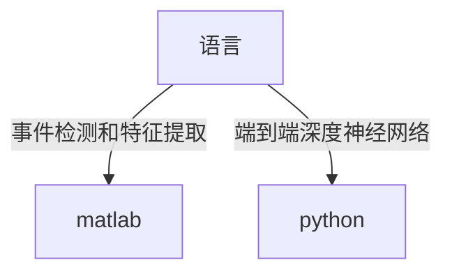

# NILM-中文教程
完成我的毕业论文，顺便记录一下NILM(非侵入式负荷监测)的学习过程，帮助其他研究NILM的中国学生轻松上手

这三十天我会陆续更新，直到完成我的毕业论文

如果你同样对NILM感兴趣，欢迎加我QQ 1400237799，互相学习互相进步。

**如果你觉得这个仓库对你有一点点帮助，请给个小星星:star:**
## 投稿推荐
Sensors（SCI三区）特刊“具有有意义的性能评估的实用非侵入式负载监控方法” **稿件提交截止日期：2023 年 6 月 30 日**
https://www.mdpi.com/journal/sensors/special_issues/practical_nonintrusive_load_monitoring_approaches_with_meaningful_performance_evaluation
## 一些汇总仓库（英文）：
### awesome NILM 
一个包含优秀的NILM文章的仓库，但只有文章链接https://github.com/ch-shin/awesome-nilm 个人认为不公开源代码的不算优秀，是骡子是马拉出来遛遛
### awesome NILM with code
一个包含优秀的公开代码的NILM文章的仓库https://github.com/zhgqcn/awesome-NILM-with-code
### ~~nilm-papers-with-code~~
https://github.com/klemenjak/nilm-papers-with-code 功能同上，但是2021年后就不更新了，内容也少，还是看上面那个仓库

## 选择编程语言

关于做NILM方向选择编程语言主要有两个，一个是用matlab，一个是用python。如果你主要想在事件检测和特征提取方面做文章，也就是搞机器学习，最好选择matlab，因为这部分可以借鉴的代码多。如果你想做端到端的方法，一般在神经网络方面做文章，也就是搞深度学习，最好选择python，因为这部分开源的代码都是用python写的。

## NILM工具或框架
### [NILMTK](https://github.com/nilmtk/nilmtk) 著名的NILM工具包

著名的NILM工具包，最棒的是用它可以很方便的读取现有的各种NILM数据集

#### [NILMTK-Contrib](https://github.com/nilmtk/nilmtk-contrib)
基于NILMTK，提供了一些经常使用的算法。
这里Contrib的意思是这些算法是NILMTK团队之外的学者提出的

** NILMTK和NILMTK-Contrib的国内最简单安装教程见：https://github.com/shaoshuai6666/NILM-Chinese/blob/main/Installation_Tutorial.md

## 相关研究机构
1. [非侵入式负载监测国际研讨会(International Workshop on Non-Intrusive Load Monitoring)](http://nilmworkshop.org/)
2. [欧盟NILM研讨会(EU NILM Workshop)](https://www.oliverparson.co.uk/eu-nilm-workshop)
2. [弗劳恩霍夫微电子电路与系统研究所(Fraunhofer IMS)](https://www.ims.fraunhofer.de/en/Business_Units_and_Core_Competencies/Electronic-Assistance-Systems/Applications/NILM.html)
## 我个人认为不错的工作，适合新手学习
### nilmtk-dl
一个中国学生写的本科毕业设计，主要是根据的NILMTK-Contrib中的改了一些，从2020年后不更新了

### [NILM-TTRNet](https://github.com/shaoshuai6666/NILM-TTRNet)
我自己写的一个用于NILM的名为TTRNet的深度学习网络，基于Transfomer等多个网络改进的，用的PyTorch框架，个人认为是非常不错的:joy:

## BOOKS
NILM相关书籍，
|  Non-intrusive Load Monitoring: Theory, Technologies and Applications   | Machine Learning Approaches to Non-Intrusive Load Monitoring  |
|  :----:  | :----:  |
|   |  |
| [Z-Library](https://1lib.tk/book/5403114/63d09c?dsource=recommend)  | [Z-Library](https://1lib.tk/book/5400202/1835fe?dsource=recommend) |
| [PDF](https://1lib.tk/dl/5403114/1d1043?openInBrowser)  | [PDF](https://1lib.tk/dl/5400202/6093fa?dsource=recommend&openInBrowser) |
